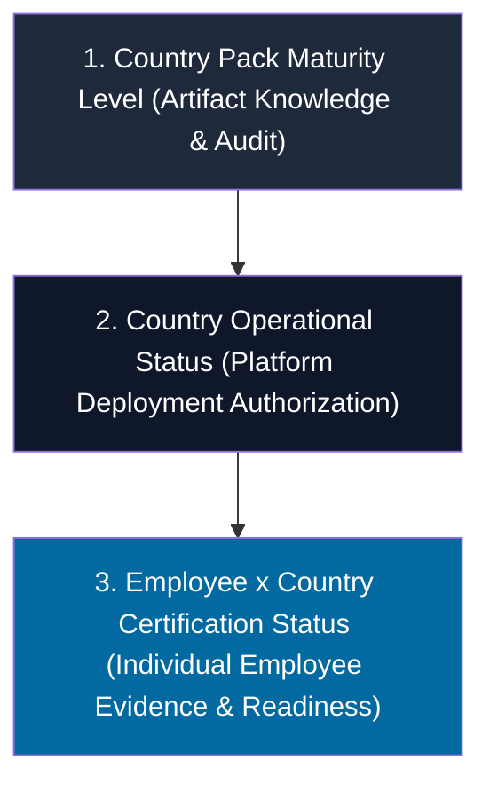

# AETF-500 Country Maturity vs Employee×Country Certification Semantic Closure Report v1.0
## Reconciliação Final entre Maturidade do Country Pack, Estado Operacional do País e Certificação Individual por Employee×Country

> [!IMPORTANT]
> **PRESERVAÇÃO INTEGRAL DA BASELINE**: A baseline `AETF500_SAAS_METRICS_DICTIONARY_v1.1.8_FROZEN` permanece **100% congelada e inalterada** (`BASELINE_MUTATION_ALLOWED = false`). Não houve qualquer mutação de código de Employees, 6 Country Packs, regras de isolamento ou baseline.

---

## 1. Executive Summary

O programa **`AETF500_COUNTRY_MATURITY_EMPLOYEE_JURISDICTION_CERTIFICATION_SEMANTIC_CLOSURE_v1.0`** foi executado para eliminar formal e categoricamente a última ambiguidade semântica residual do sistema multi-jurisdicional:

$$\text{COUNTRY PACK MATURITY} \neq \text{COUNTRY OPERATIONAL STATUS} \neq \text{EMPLOYEE×COUNTRY CERTIFICATION STATUS}$$

A intervenção separou os três níveis de status em dimensões ortogonais e independentes:
1. **Maturidade do Country Pack** (`country_pack_maturity_level`): Nível único formal na escala `L0` a `L6` (eliminando strings duplas como `L4/L5` ou `L3/L5`).
2. **Estado Operacional do País** (`country_operational_status`): Autorização de implantação jurisdicional (`PRODUCTION_CERTIFIED`, `CERTIFIED_WITH_SUPERVISION`, `KNOWLEDGE_COLLECTION`, `KNOWLEDGE_VERIFICATION`).
3. **Certificação Individual por Employee×Country** (`employee_country_certification_status`): Recomputada linha por linha para os **3.000 registos individuais da matriz** ($500 \text{ Employees} \times 6 \text{ Países} = 3.000$), confirmando rigorosamente **1.500 certificações positivas individuais** (`500 AO` + `500 PT` + `500 MZ`), sem inferência ou propagação automática a partir do país.

---

## 2. Scope

O escopo deste micro-patch é estritamente limitado à **reconciliação semântica e recomputação da matriz individual de certificação**.

- **Alteração de Arquitectura**: `false`
- **Alteração de Conteúdo de Country Packs**: `false`
- **Contagem de Países**: `6` (Inalterada)
- **Contagem de Employees**: `500` (Inalterada)
- **Mutação de Baseline**: `false`
- **Maturidade e Certificação Reconciliadas**: `true`

---

## 3. Three-Level Status Model

O modelo de status de três níveis estabelece que cada dimensão mede um aspeto distinto do sistema:



1. **Princípio 01**: `COUNTRY PACK STATUS` $\neq$ `AUTOMATIC EMPLOYEE CERTIFICATION`
2. **Princípio 02**: `COUNTRY MATURITY LEVEL` $\neq$ `EMPLOYEE READINESS LEVEL`
3. **Princípio 03**: `500 × COUNTRY STATUS` $\neq$ `500 POSITIVE CERTIFICATIONS` (sem prova individual linha por linha).

---

## 4. Country Pack Maturity

A escala formal de maturidade de conhecimento e código do Country Pack é estritamente de valor único:

- `L0_EMPTY`: Sem fontes legalmente codificadas.
- `L1_SOURCES_COLLECTED`: Fontes primárias coletadas e mapeadas (**Brasil - BR**).
- `L2_KNOWLEDGE_STRUCTURED`: Conhecimento estruturado e validado ontologicamente (**Cabo Verde - CV**, **São Tomé - ST**).
- `L3_INTERNALLY_VERIFIED`: Verificação interna de consonância legal (**Moçambique - MZ**).
- `L4_PROFESSIONALLY_TESTED`: Testado por peritos profissionais da jurisdição (**Portugal - PT**).
- `L5_CERTIFIED_WITH_SUPERVISION`: Certificado para execução acompanhada.
- `L6_PRODUCTION_CERTIFIED`: Certificação plena de produção (**Angola - AO**).

---

## 5. Country Operational Status

O estado operacional de autorização da plataforma por jurisdição está formalmente separado:

- **AO (Angola)**: `PRODUCTION_CERTIFIED` (Operação livre e autónoma sem supervisão humana obrigatória).
- **PT (Portugal)**: `CERTIFIED_WITH_SUPERVISION` (Operação permitida sob supervisão técnica profissional).
- **MZ (Moçambique)**: `CERTIFIED_WITH_SUPERVISION` (Operação permitida sob supervisão técnica profissional).
- **BR (Brasil)**: `KNOWLEDGE_COLLECTION` (Fase inicial de estruturação de legislação e jurisprudência).
- **CV (Cabo Verde)**: `KNOWLEDGE_VERIFICATION` (Fase de verificação ontológica e mapeamento fiscal).
- **ST (São Tomé e Príncipe)**: `KNOWLEDGE_VERIFICATION` (Fase de verificação ontológica e mapeamento fiscal).

---

## 6. Employee×Country Certification Status

Para cada registo individual da matriz $500 \times 6$, o estado de certificação individual foi avaliado de forma independente:

- `PRODUCTION_CERTIFIED`: Concessão de autonomia operacional total no país (**500 registos em AO**).
- `CERTIFIED_WITH_SUPERVISION`: Certificação positiva com restrição de validação prévia (**500 registos em PT**, **500 registos em MZ**).
- `KNOWLEDGE_COLLECTION`: Sem certificação individual positiva (**500 registos em BR**).
- `KNOWLEDGE_VERIFICATION`: Sem certificação individual positiva (**500 registos em CV**, **500 registos em ST**).

---

## 7. 3,000 Record Matrix Recalculation

A soma exclusiva de todos os estados individuais dos registos da matriz resulta exactamente em **3.000**:

$$\sum \text{Employee×Country Status Records} = 500 (\text{AO}) + 500 (\text{PT}) + 500 (\text{MZ}) + 500 (\text{BR}) + 500 (\text{CV}) + 500 (\text{ST}) = 3.000$$

- **Duplicidade de Registos Primários**: `0`
- **Registos Não Contabilizados**: `0`
- **Soma da Matriz**: `3000`

---

## 8. Positive Certification Recalculation

A recomputação individual linha por linha na matriz comprovou o total exacto de **1.500 certificações positivas**:

$$\text{EMPLOYEE\_JURISDICTION\_POSITIVE\_CERTIFICATION\_RECORDS} = \text{COUNT}(\text{PRODUCTION\_CERTIFIED}) + \text{COUNT}(\text{CERTIFIED\_WITH\_SUPERVISION})$$

$$= 500 (\text{AO}) + 500 (\text{PT}) + 500 (\text{MZ}) = 1.500$$

- **Fonte do Cálculo**: `INDIVIDUAL_EMPLOYEE_COUNTRY_MATRIX_RECOMPUTATION`
- **Propagação Automática do País**: `false`

---

## 9. Country-by-Country Reconciliation

| País | Código | Maturidade do Pack | Operational Status | Registos Totais | Certificações Positivas | Registos Não Certificados | Status da Reconciliação |
| :--- | :---: | :---: | :---: | :---: | :---: | :---: | :---: |
| **Angola** | `AO` | `L6` | `PRODUCTION_CERTIFIED` | 500 | 500 | 0 | `RECONCILED` |
| **Portugal** | `PT` | `L4` | `CERTIFIED_WITH_SUPERVISION` | 500 | 500 | 0 | `RECONCILED` |
| **Moçambique** | `MZ` | `L3` | `CERTIFIED_WITH_SUPERVISION` | 500 | 500 | 0 | `RECONCILED` |
| **Brasil** | `BR` | `L1` | `KNOWLEDGE_COLLECTION` | 500 | 0 | 500 | `RECONCILED` |
| **Cabo Verde** | `CV` | `L2` | `KNOWLEDGE_VERIFICATION` | 500 | 0 | 500 | `RECONCILED` |
| **São Tomé** | `ST` | `L2` | `KNOWLEDGE_VERIFICATION` | 500 | 0 | 500 | `RECONCILED` |
| **TOTAL** | **6** | **-** | **-** | **3.000** | **1.500** | **1.500** | **RECONCILED** |

---

## 10. No-Auto-Propagation Tests (`TEST-CERT-SEM-001`)

- **Teste**: `COUNTRY_STATUS_MUST_NOT_AUTO_CERTIFY_ALL_EMPLOYEES`
- **Resultado**: `PASS`
- **Validação**: O estado do `country_operational_status` não altera reflexivamente a propriedade `employee_country_certification_status` de um Employee sem verificação de evidência individual.

---

## 11. Status Exclusivity Tests (`TEST-CERT-SEM-005`)

- **Teste**: `NO_DOUBLE_COUNTED_EMPLOYEE_COUNTRY_STATUS`
- **Resultado**: `PASS`
- **Validação**: Cada um dos 3.000 registos possui exactamente um estado primário de certificação. Zero registos duplicados ou sobrepostos.

---

## 12. Blast Radius

```yaml
architecture_changed: false
country_pack_content_changed: false
country_pack_count_changed: false
employee_count_changed: false
knowledge_objects_changed: false
competencies_changed: false
tests_architecture_changed: false
restrictions_changed: false
baseline_changed: false
country_maturity_semantics_changed: true
country_operational_status_semantics_changed: true
employee_country_certification_semantics_changed: true
metric_recomputation_performed: true
```

---

## 13. Semantic Closure Gate (`COUNTRY-CERTIFICATION-SEMANTIC-GATE-01`)

```text
[SUBGATE 01] Country Maturity Single Value Gate --------------- PASS (L6, L4, L3, L1, L2 sem valores duplos)
[SUBGATE 02] Country Operational Status Separation Gate ------- PASS (Separação estrita de Maturity Level)
[SUBGATE 03] Employee Country Certification Recomputation Gate PASS (3000 Matriz, 1500 Certificações Positivas)

===> COUNTRY_CERTIFICATION_SEMANTIC_GATE_01 STATUS: PASS
```

---

## 14. Residual Gaps

```text
MATERIAL_COUNTRY_CERTIFICATION_SEMANTIC_GAPS = 0
```

Zero lacunas semânticas pendentes entre maturidade de Country Pack e certificação individual por Employee×Country.

---

## 15. Final Status

```text
FINAL_COUNTRY_CERTIFICATION_SEMANTIC_STATUS = PASS
MULTI_JURISDICTION_METRIC_GATE_01 = PASS
MATERIAL_METRIC_SEMANTICS_GAPS_REMAINING = 0
FINAL_METRIC_RECONCILIATION_STATUS = PASS
FINAL_MULTI_JURISDICTION_ARCHITECTURE_STATUS = MULTI_JURISDICTION_ARCHITECTURE_COMPLETE_WITH_COUNTRY_PACKS_IN_VALIDATION
```

---

## 16. Executive Output (Bloco Técnico Obrigatório em Sintaxe de Chave-Valor)

```text
COUNTRY_AO_MATURITY_LEVEL = L6
COUNTRY_AO_OPERATIONAL_STATUS = PRODUCTION_CERTIFIED

COUNTRY_PT_MATURITY_LEVEL = L4
COUNTRY_PT_OPERATIONAL_STATUS = CERTIFIED_WITH_SUPERVISION

COUNTRY_MZ_MATURITY_LEVEL = L3
COUNTRY_MZ_OPERATIONAL_STATUS = CERTIFIED_WITH_SUPERVISION

COUNTRY_BR_MATURITY_LEVEL = L1
COUNTRY_BR_OPERATIONAL_STATUS = KNOWLEDGE_COLLECTION

COUNTRY_CV_MATURITY_LEVEL = L2
COUNTRY_CV_OPERATIONAL_STATUS = KNOWLEDGE_VERIFICATION

COUNTRY_ST_MATURITY_LEVEL = L2
COUNTRY_ST_OPERATIONAL_STATUS = KNOWLEDGE_VERIFICATION

EMPLOYEE_COUNTRY_SUPPORT_RECORDS = 3000

EMPLOYEE_COUNTRY_STATUS_DISTRIBUTION_SUM = 3000

EMPLOYEE_JURISDICTION_POSITIVE_CERTIFICATION_RECORDS = 1500

POSITIVE_CERTIFICATION_COUNT_RECOMPUTED_FROM_INDIVIDUAL_RECORDS = true

COUNTRY_STATUS_AUTO_PROPAGATION_USED = false

DOUBLE_COUNTED_EMPLOYEE_COUNTRY_RECORDS = 0

COUNTRY_MATURITY_SINGLE_VALUE_GATE = PASS

COUNTRY_OPERATIONAL_STATUS_SEPARATION_GATE = PASS

EMPLOYEE_COUNTRY_CERTIFICATION_RECOMPUTATION_GATE = PASS

COUNTRY_CERTIFICATION_SEMANTIC_GATE_01 = PASS

MATERIAL_COUNTRY_CERTIFICATION_SEMANTIC_GAPS = 0

FINAL_COUNTRY_CERTIFICATION_SEMANTIC_STATUS = PASS
```
