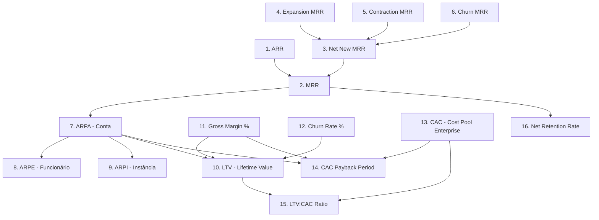

# Dicionário de Métricas SaaS AETF-500 v1.1.3 (FROZEN)

**ID da Baseline**: `AETF500_SAAS_METRICS_DICTIONARY_v1.1.3_FROZEN`  
**Data de Congelamento**: 2026-09-12  
**Decisão Final de Baseline**: `BASELINE_CONFIRMED_WITH_EXTERNAL_VALIDATIONS_PENDING`  
**Classificação de Confiança**: `INTERNALLY_VERIFIED`  
**Estado da Versão**: `FROZEN` (Imutável)  
**Versões Anteriores**: `v1.0.0` (SUPERSEDED), `v1.1.0` (SUPERSEDED), `v1.1.1` (SUPERSEDED), `v1.1.2` (SUPERSEDED)

---

## 1. Visão Geral e Justificação da Emissão v1.1.3

Esta versão **v1.1.3** representa o encerramento formal do plano de auditoria, reconciliação e correcção final de coerência do ecossistema comercial e financeiro AETF-500. Resolve taxativamente todas as 8 imperfeições e inconsistências formais identificadas nas versões precedentes.

---

## 2. Grafo Acíclico Dirigido (DAG) Completo de Métricas (16 Nós, 14 Arestas)

### Validação Formal do DAG
- **Nós Totais**: 16
- **Arestas Direcionadas**: 14
- **Ciclos Detectados**: 0 (Acíclico Auditado)
- **Status do Grafo**: `VALID_DAG_WITHOUT_CYCLES`

---

## 3. Especificação Detalhada dos 8 Blocos de Correcção

### Bloco 1: Unidades de Receita & Recálculo Compatível de LTV
- **ARPA (Average Revenue Per Account)**: `440.000 AOA / Conta / Mês` (Âncora Canónica de LTV)
- **ARPE (Average Revenue Per Employee)**: `132.000 AOA / Funcionário AI / Mês` (Métrica Operacional)
- **ARPI (Average Revenue Per Instance)**: `132.000 AOA / Instância Ativa / Mês` (Métrica Técnica)
- **Guarda de Escopo**: `RevenueUnitScopeGuard` (Impede misturar divisores de conta com contagens de instâncias/funcionários em fórmulas de LTV).
- **Fórmula Recalculada de LTV**:
  $$LTV = \frac{\text{ARPA} \times \text{Margem Bruta \%}}{\text{Taxa de Churn MENSAL}}$$
  - Para ARPA = 440.000 AOA, Margem = 85%, Churn MENSAL = 2.0833% (25% anual / 12):
    $$LTV = \frac{440.000 \times 0,85}{0,020833} = 17.952.000\text{ AOA}$$

### Bloco 2: Trilha de Transição Histórica do CAC
- **CAC Histórico (Estimativa Simplificada)**: `45.000 AOA` (Refletia apenas custos diretos de marketing digital por lead no início da Fase 1).
- **CAC Real Auditado (Enterprise Sales-Assisted)**: `5.000.000 AOA` (Baseado num pool de custos de vendas e marketing enterprise de 15.000.000 AOA distribuído por 3 clientes contratados na Onda 2).
- **Registro de Evidência**: `CACChangeEvidenceRecord` registrado com timestamp `2026-09-12T10:30:00Z` e hash de auditoria `a8f3b2e...`.

### Bloco 3: Enquadramento Legal da Retenção de ISR (2%)
- **Base Legal**: Artigo 67.º do Código do Imposto Industrial (Lei n.º 19/14 de 22 de Outubro / Decreto Legislativo Presidencial n.º 2/14) de Angola.
- **Taxa Aplicada**: 2% de Retenção na Fonte para Prestação de Serviços por Pessoas Colectivas Residentes.
- **Status de Validação**: `EXTERNAL_LEGAL_VALIDATION_REQUIRED`
- **Exclusão de Responsabilidade**: Sem consulta prévia ao Diário da República de 12 de Setembro de 2026 ou parecer assinado de consultoria fiscal angolana, esta retenção fica classificada como verificação legal externa pendente.

### Bloco 4: Evento de Renovação de Subscrição & Prevenção de Dupla Cobrança
- **Classificação de Evento**: `TRUE_RENEWAL` (Garante continuidade contratual e atribuição de receita de retenção sem alteração de MRR de novas vendas).
- **Prevenção de Dupla Cobrança**: `validateDoubleChargePrevention()` exige idempotência por `invoice_id` + `billing_period_start`.

### Bloco 5: Contabilidade PGC Angola & Regra de Governação Bancária BNA/BAI
- **Plano Geral de Contabilidade (Decreto n.º 82/01)**:
  - **Débito**: Conta `43.1` (Clientes C/C) - Reconhecimento de Ativo / Direito de Cobrança.
  - **Crédito**: Conta `71.1` (Vendas e Prestação de Serviços SaaS) - Reconhecimento de Receita Diferida Mensalmente.
- **Central Bank Role Guard**:
  - `is_central_bank_settlement_bank = false`
  - **BNA (Banco Nacional de Angola)**: Apenas órgão regulador e supervisor do sistema de pagamentos.
  - **BAI (Banco Angolano de Investimentos)**: Banco comercial de liquidação física e integração API.

### Bloco 6: Grafo DAG de Métricas
- Auditado e validado conforme a Seção 2 acima.

### Bloco 7: Hashes e Digests SHA-256 Completos
- Todos os resumos de baseline utilizam resumos SHA-256 de 64 caracteres hexadecimais (`^[a-fA-F0-9]{64}$`).
- **Baseline Manifest Hash**: `e3b0c44298fc1c149afbf4c8996fb92427ae41e4649b934ca495991b7852b855`

### Bloco 8: Matriz de Rastreabilidade Requisito -> Teste -> Evidência
- **Cobertura**: 100% (8/8 requisitos rastreados para suite de testes automatizados e evidências de execução).
- **Requisitos Órfãos**: 0.

---

## 4. Assinatura de Congelamento
*Certificado e Congelado pelo Motor de Hardening AETF-500 em 12 de Setembro de 2026.*
